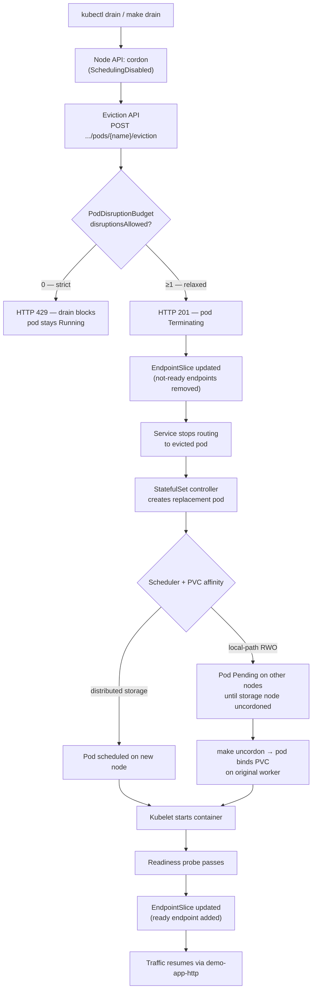

# Drain → Eviction → PDB → Replacement workflow

**Audience:** Platform / SRE engineers  
**Duration:** ~15–20 minutes (standalone) or as Act 7 in the full demo  
**Prerequisites:** `make setup` completed; cluster context `kind-pdb-pvc-demo`

**Related docs:** [DEMO.md](DEMO.md) (full narrative) · [DEMO-STEPS.md](DEMO-STEPS.md) (command cheat sheet) · [README.md](../README.md)

This document walks through what happens when you run **`kubectl drain`** on a worker that hosts a demo pod — from node cordon through the Eviction API, PDB enforcement, endpoint updates, and StatefulSet-driven replacement. It is adapted for **this repo's StatefulSet + PVC** setup, not a Deployment/ReplicaSet workload.

---

## What this demo uses

| Resource | Name | Notes |
|----------|------|-------|
| Workload | **StatefulSet** `demo-app` | 2 replicas, `Parallel` pod management — the **StatefulSet controller** recreates missing pods |
| Pods | `demo-app-0`, `demo-app-1` | Stable names; each bound to its own PVC |
| PVCs | `data-demo-app-0`, `data-demo-app-1` | 1Gi RWO via kind `local-path` — **node-local** affinity |
| PDB | `demo-app-pdb` | Relaxed (`minAvailable: 1`) or strict (`minAvailable: 2`) |
| Services | `demo-app` (headless), `demo-app-http` (ClusterIP + NodePort) | EndpointSlices track **ready** pod endpoints |
| GitOps | Argo CD Application `demo-app` | `selfHeal: true` — pause sync before manual PDB/drain experiments |

> **Deployment contrast:** In a typical Deployment, a **ReplicaSet** owns pod replicas and creates replacements after eviction. Here, the **StatefulSet controller** performs that role — same outcome (a new pod object), different owner reference and naming rules.

---

## End-to-end flow (adapted for this repo)



ASCII equivalent:

```
kubectl drain  (or make drain)
       │
       ▼
Node API (cordon — spec.unschedulable: true)
       │
       ▼
Eviction API  (policy/v1 subresource per pod)
       │
       ▼
PodDisruptionBudget
       ├── disruptionsAllowed = 0  →  HTTP 429, drain fails/times out
       └── disruptionsAllowed ≥ 1  →  HTTP 201, pod Terminating
                │
                ▼
       EndpointSlice updated  (endpoints controller)
                │
                ▼
       Service stops routing to terminating pod
       (demo-app-http NodePort — http://localhost:30090/)
                │
                ▼
       StatefulSet controller recreates missing ordinal
       (NOT ReplicaSet/Deployment — same idea, different owner)
                │
                ▼
       Scheduler → node choice constrained by PVC node affinity
       (kind local-path: often Pending until uncordon)
                │
                ▼
       Kubelet starts pod → readinessProbe passes
                │
                ▼
       EndpointSlice updated (ready endpoint back)
                │
                ▼
       Traffic resumes
```

---

## API discovery — see the objects behind the flow

Before running the workflow, explore which API groups and resources are involved. Eviction is a **pod subresource** — it does not appear in `kubectl api-resources` as a first-class kind.

```bash
# All API groups and versions on this cluster
kubectl api-versions | sort

# Resources in the policy API group (includes PodDisruptionBudget)
kubectl api-resources --api-group=policy

# Workload APIs — StatefulSet lives here (not Deployments in this demo)
kubectl api-resources --api-group=apps | grep -E 'NAME|statefulset|deployment|replicaset'

# Node operations use the core v1 Node kind
kubectl api-resources --api-group="" | grep -E 'NAME|nodes|pods|services|endpoints'

# EndpointSlices (discovery.k8s.io) — how Services track ready backends
kubectl api-resources --api-group=discovery.k8s.io

# Raw discovery — JSON listing of available API paths
kubectl get --raw /apis | jq -r '.groups[].name' 2>/dev/null || kubectl get --raw /apis
kubectl get --raw /apis/policy/v1
kubectl get --raw /apis/apps/v1
kubectl get --raw /apis/discovery.k8s.io/v1

# PDB is a namespaced policy object
kubectl get --raw /apis/policy/v1/namespaces/demo/poddisruptionbudgets

# Eviction path (subresource — discover via proxy, not api-resources)
# POST /api/v1/namespaces/demo/pods/demo-app-0/eviction
```

**Talking point:** `kubectl api-resources` lists **creatable** API objects. Voluntary disruption goes through the **Eviction subresource** on pods; PDB is the policy object that gates it. Cordon/drain uses the **Node** API (`kubectl cordon` patches `spec.unschedulable`).

---

## Pause Argo CD sync before maintenance demos

Argo CD `selfHeal: true` reverts manual changes (PDB patches, direct `kubectl apply`) back to git within minutes. **Pause automated sync** before switching PDB modes or running drain so the cluster state matches your story.

### Why pause?

| Without pause | What goes wrong |
|---------------|-----------------|
| `kubectl apply` strict PDB | Argo CD reverts to relaxed PDB from git |
| `make argocd-strict` then manual kubectl edits | selfHeal restores git truth |
| Cordon/drain during sync | Confusing race between GitOps reconcile and eviction |

`make act-drain` calls `make argocd-pause-sync` automatically. For manual runs, pause first.

### Via Argo CD UI

1. Open **http://localhost:30080** (no login in this demo).
2. Click **demo-app**.
3. Open **App Details** (info panel / top bar).
4. Under **Sync Policy**, click **Edit** (or **Disable Auto-Sync**).
5. Set policy to **Manual** — automated sync and self-heal stop until you resume.
6. To restore: **Enable Auto-Sync** with **Prune** and **Self Heal**, or run `make argocd-resume-sync`.

### Via command line

**Makefile (recommended):**

```bash
make argocd-pause-sync    # sync-policy manual
# ... run PDB switch + drain demo ...
make argocd-resume-sync   # automated + prune + selfHeal
```

**argocd CLI** (same as Makefile):

```bash
argocd --core --argocd-namespace argocd app set demo-app -N argocd --sync-policy manual
argocd --core --argocd-namespace argocd app set demo-app -N argocd \
  --sync-policy automated --auto-prune --self-heal
```

**kubectl patch** (no argocd CLI required):

```bash
# Pause — remove automated sync block
kubectl patch application demo-app -n argocd --type json \
  -p='[{"op": "remove", "path": "/spec/syncPolicy/automated"}]'

# Resume — restore prune + selfHeal
kubectl patch application demo-app -n argocd --type merge \
  -p '{"spec":{"syncPolicy":{"automated":{"prune":true,"selfHeal":true}}}}'

# Verify
kubectl get application demo-app -n argocd -o jsonpath='{.spec.syncPolicy}{"\n"}'
```

---

## Hands-on: strict PDB blocks drain (~10 min)

**Talking point:** With 2 replicas and `minAvailable: 2`, **zero** voluntary disruptions are allowed. `kubectl drain` calls the Eviction API for each pod on the node; PDB returns HTTP 429 and the drain fails or times out.

### Prep

```bash
make preflight
make status
make demo-url          # http://localhost:30090/ — visual anchor for traffic
make argocd-pause-sync
make argocd-strict
```

### Baseline observations

```bash
# Nodes and pod placement
kubectl get nodes -o wide
kubectl get pods -n demo -o wide -l app=demo-app

# PDB math — must show ALLOWED DISRUPTIONS: 0
kubectl get pdb -n demo demo-app-pdb -o wide
kubectl get pdb -n demo demo-app-pdb -o jsonpath='allowed={.status.disruptionsAllowed}{"\n"}'

# Services and endpoints (ready backends only)
kubectl get svc -n demo demo-app demo-app-http
kubectl get endpointslices -n demo -l kubernetes.io/service-name=demo-app-http -o wide
```

Note which worker hosts `demo-app-0` (or `demo-app-1`) — that node becomes the drain target.

### Run drain

```bash
make act-drain
# equivalent to: make argocd-pause-sync && make argocd-strict && make drain
```

Or manually:

```bash
NODE=$(kubectl get pods -n demo demo-app-0 -o jsonpath='{.spec.nodeName}')
kubectl cordon "$NODE"
kubectl drain "$NODE" --ignore-daemonsets --delete-emptydir-data --grace-period=30 --timeout=120s
```

### Observe each stage

| Stage | What to run | Expected |
|-------|-------------|----------|
| Cordon | `kubectl get node "$NODE"` | `SchedulingDisabled` |
| Eviction blocked | `kubectl get events -n demo --sort-by='.lastTimestamp' \| tail -15` | PodDisruptionBudget messages |
| PDB | `kubectl get pdb -n demo` | `ALLOWED DISRUPTIONS: 0` |
| Pods unchanged | `kubectl get pods -n demo -o wide` | Same UIDs; demo pod still on cordoned node |
| Endpoints stable | `kubectl get endpointslices -n demo -l kubernetes.io/service-name=demo-app-http` | Still 2 ready endpoints |
| Browser | Refresh http://localhost:30090/ | Page still loads from running pod |

**Key point:** Argo CD can show **Synced / Healthy** while drain fails — GitOps applied the strict PDB successfully; the policy intentionally blocks maintenance.

### Restore

```bash
make uncordon
make argocd-relaxed
make argocd-resume-sync
make status
```

---

## Hands-on: relaxed PDB permits eviction (~10 min)

**Talking point:** With `minAvailable: 1`, one pod may be evicted. Drain succeeds for that pod, but **kind's local-path PV** has required node affinity — the replacement pod often stays **Pending** on another worker until you uncordon the storage node.

### Prep

```bash
make argocd-pause-sync
make argocd-relaxed
make uncordon            # clear any prior cordon
make status
```

Confirm `ALLOWED DISRUPTIONS: 1`.

### Run drain

```bash
make drain
```

### Observe replacement chain

```bash
# Watch pod phase — Terminating → Pending (on wrong node) or Running (after uncordon)
kubectl get pods -n demo -l app=demo-app -w

# StatefulSet status — desired vs current replicas
kubectl get statefulset -n demo demo-app
kubectl describe statefulset -n demo demo-app | tail -20

# PVC still bound — same claim, new pod object
kubectl get pvc -n demo

# EndpointSlice — ready count drops while pod is not ready
kubectl get endpointslices -n demo -l kubernetes.io/service-name=demo-app-http -o yaml

# Events — scheduling failures from PV node affinity
kubectl get events -n demo --sort-by='.lastTimestamp' | tail -20
```

| Stage | Expected in this repo |
|-------|----------------------|
| Eviction allowed | HTTP 201; one pod `Terminating` |
| EndpointSlice | Ready endpoint count drops to 1 for `demo-app-http` |
| StatefulSet | Controller creates replacement pod with same ordinal name |
| Scheduler | Replacement **Pending** — PVC pinned to cordoned worker |
| Other pod | `demo-app-1` (or sibling) stays **Running** on another worker |
| After `make uncordon` | Replacement schedules on storage node → **Running** → endpoints restore |

```bash
make uncordon
kubectl wait --for=condition=Ready pod -n demo -l app=demo-app --timeout=120s
kubectl get endpointslices -n demo -l kubernetes.io/service-name=demo-app-http
make demo-data           # optional — confirm /data marker survived on PVC
```

Refresh http://localhost:30090/ — traffic resumes when the pod is Ready and endpoints update.

### Deployment / ReplicaSet contrast (mention in talk)

| Pattern | Owner | Replacement trigger | This demo |
|---------|-------|---------------------|-----------|
| Deployment → ReplicaSet | ReplicaSet controller | Pod deleted/evicted below desired count | Not used |
| **StatefulSet** | **StatefulSet controller** | Ordinal pod missing | **demo-app** |

Eviction API and PDB behavior are identical regardless of workload type — only the controller that recreates the pod differs.

---

## Observation cheat sheet

Quick commands to run at any stage:

```bash
kubectl get nodes -o wide
kubectl get pods -n demo -o wide -l app=demo-app
kubectl get pdb -n demo -o wide
kubectl get statefulset -n demo demo-app
kubectl get pvc -n demo
kubectl get svc,endpointslices -n demo
kubectl get events -n demo --sort-by='.lastTimestamp' | tail -20
make status
```

**k9s:** `:nodes` · `:pods demo` · `:pdb demo` · `:events demo`

---

## Troubleshooting

| Symptom | Check |
|---------|-------|
| Drain succeeds under strict PDB | `kubectl get pdb -n demo` — confirm `ALLOWED DISRUPTIONS: 0`; run `make argocd-strict` |
| PDB reverts during demo | Run `make argocd-pause-sync` first |
| Pod stuck Pending after relaxed drain | Expected with local-path — `make uncordon` |
| Node still cordoned | `make uncordon` |
| Endpoints empty | `kubectl describe pod -n demo <pod>` — readiness probe failing? |

Full diagnostics: [README.md#troubleshooting](../README.md#troubleshooting).

---

## Wrap-up

1. **`kubectl drain`** cordons the node, then evicts pods via the **Eviction API** — same path as `make evict`.
2. **PDB** is enforced at that API layer (`201` vs `429`), not in the scheduler.
3. **EndpointSlices** reflect **ready** pods; traffic drops while a backend is terminating or not ready.
4. **StatefulSet** (not Deployment) recreates the ordinal pod; PVCs survive on the same claim.
5. **Pause Argo CD sync** before maintenance demos so `selfHeal` does not undo your PDB mode mid-story.

Restore default state:

```bash
make uncordon
make argocd-relaxed
make argocd-resume-sync
make status
```
